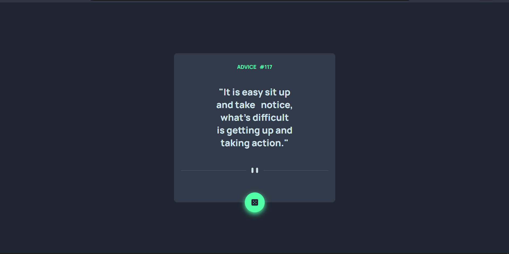
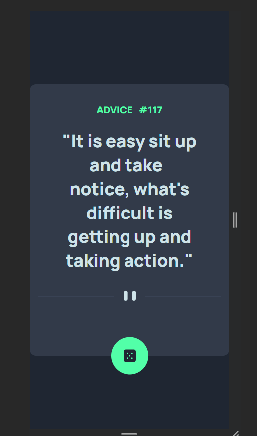

# Português (pt-BR)

# Frontend Mentor - projeto gerador de dicas e conselhos

Essa é a resolução do projeto gerador de dicas e conselhos do Frontend Mentor. O Frontend Mentor ajuda a melhorar nossas capacidades de codificação pois criamos projetos reais. 🚀

## Desafio

- Os usuários devem ver o layout completo em uma página.
- Os usuários devem ver todos elementos interativos da página.

## Screenshots

### Desktop

### Mobile

### Elementos interativos

- Os elementos interativos são um :hover no botão de receber dicas, deixando o botão com a cor verde e um fundo brilhoso verde também.

## Processo

### Construído com

- Semantic HTML5 markup
- CSS custom properties
- Flexbox
- Media-querie for mobile version
- JavaScript
- Dom
- API geradora de conselhos

### O que aprendi

Aprendi como usar algumas das tags semânticas do HTML5. Foi aprendido também como estilizar elementos com o CSS, usando formas como o display:flex, além de utilizar media-queries para deixar o site mais responsivo e fazer a versão mobile dele. Aprendi a manipular elementos usando o document, como usar o JavaScript e também como consumir uma API.

### Projetos seguintes

Pretendo continuar fazendo mais projetos, estou seguindo o curso DevQuest e lá existem diversos outros projetos e exercícios a serem feitos. Muito obrigado, Roberto e Ricardo! 😁

### Recursos úteis

Como citado anteriormente, estou fazendo o DevQuest, que me foi muito útil para a realização desse projeto. Ele é fortemente recomendado para quem quer ingressar na área, quem está aprendendo a parte de Frontend e se sente um pouco perdido por onde começar ou até mesmo por onde continuar.

### Autor

- GitHub - [Kevin Desbessell] https://github.com/kevin-desbessell
- Frontend Mentor - https://www.frontendmentor.io/profile/kevin-desbessell
- Instagram - https://www.instagram.com/kevin_desbessell/?next=%2F
- E-mail - kevindesbessell@gmail.com